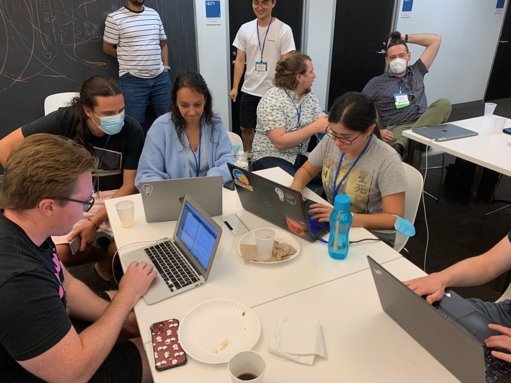

This week I had the opportunity to participate in the NRCSS 2022 at the ICERM in Providence, Rhode Island. The week was packed with lectures in NR, Relativistic Hydrodynamics, High Performance Computing, and Waveforms, as well as tutorials for using the different available NR codes. The summer school closed with a hackaton, which let us start a project from scratch.

I must say I took a lot from this school, and I'm inspired to pursue my own projects. The networking with other PhD students in the area as well as the exchange of ideas that took place was very valuable.

