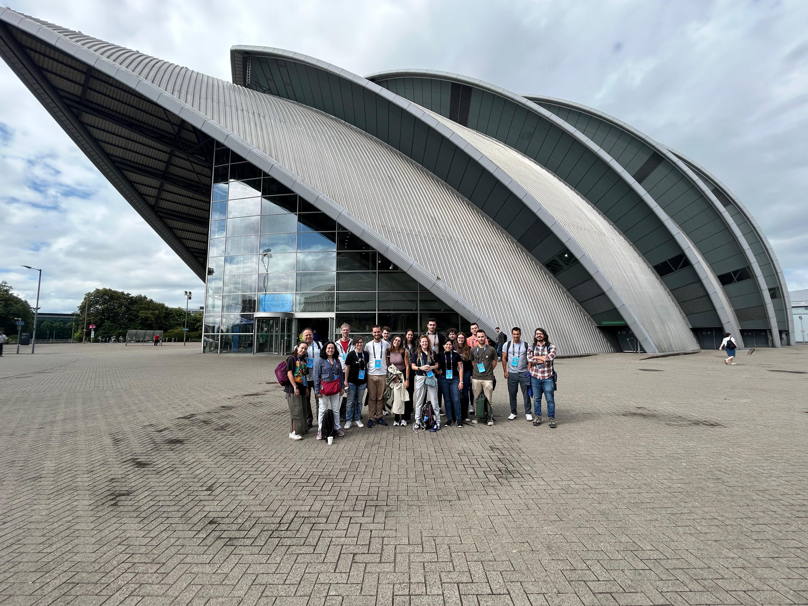

This summer I attended the [24th International Conference on General Relativity and Gravitation (GR24) and the 16th Edoardo Amaldi Conference on Gravitational Waves (Amaldi16)](https://iop.eventsair.com/gr24-amaldi16/) which were celebrated together in Glasgow, UK. The talk I presented during this meeting was on my recent paper, [Black-hole - neutron-star mergers: new numerical-relativity simulations and multipolar effective-one-body model with spin precession and eccentricity](https://arxiv.org/abs/2507.00113).

