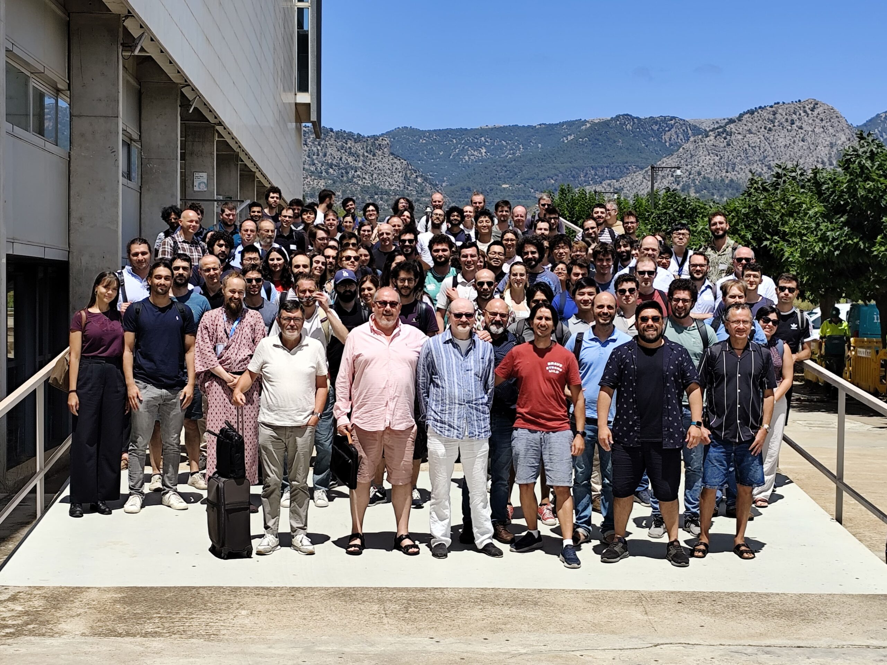

The next conference I attended this summer was the [New Frontiers 2025: past, current and future challenges in Numerical Relativity](https://grg.uib.es/newfrontiersNR25/) in Palma, Spain. I had the opportunity to give a talk about my recent paper, [Black-hole - neutron-star mergers: new numerical-relativity simulations and multipolar effective-one-body model with spin precession and eccentricity](https://arxiv.org/abs/2507.00113).

