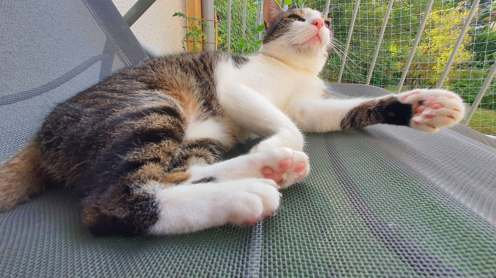

## Education

- [2021-ongoing] PhD in Physics, Friedrich-Schiller-University of Jena, Germany
- [2019-2021] MSc. Physics, Friedrich-Schiller-University of Jena, Germany
- [2015-2016] DAAD Academic Exchange, Georg-August-University of Goettingen, Germany
- [2012-2017] BSc. Physics, Universidad Autonoma de Nuevo Leon, Mexico

### Thesis

- **Master thesis**: Analytical Waveform Model of Black Hole-Neutron Star binary systems
- **Bachelor thesis**: [Optimization of the Electron Veto for the identification of hadronically decaying Tau leptons with the ATLAS detector](https://www.uni-goettingen.de/de/document/download/288e5460a87426975dcb65ae5a490067.pdf/Bachelorarbeit_Alejandra_Pillado_Gonzalez.pdf)

### Schools and Courses

- [2023] Scientific Visualization, Stuttgart, Germany
- [2023] Elements of Computational and Data Science, Jena, Germany
- [2022] Numerical Relativity Community Summer School, Providence, USA
- [2021] Parallel Programming Workshop, online
- [2019] Pearls of Theoretical Physics School, Jena, Germany
- [2017] Particles, Strings and Cosmology summer School, Hamburg, Germany
- [2016] General Relativity and Gravitational Waves School, Guadalajara, Mexico
- [2016] Hadron Collider Summer School, Goettingen, Germany
- [2015] 9th Astrophysics Summer School, Morelia, Mexico
- [2014] 23th Summer in the Observatory, Ensenada, Mexico

## Publications and Preprints

- A. Gonzalez, R. Gamba, M. Breschi, F. Zappa, G. Carullo, S. Bernuzzi and A. Nagar. *Numerical-Relativity-Informed Effective-One-Body model for Black-Hole-Neutron-Star Mergers with Higher Modes and Spin Precession*, [Phys. Rev. D 107, 084026](https://journals.aps.org/prd/abstract/10.1103/PhysRevD.107.084026)
- A. Gonzalez, F. Zappa, M. Breschi, S. Bernuzzi, D. Radice, A. Adhikari, A. Camilletti, S. V. Chaurasia, G. Doulis and S. Padamata, et al. *Second release of the CoRe database of binary neutron star merger waveforms*, 2023 Class. Quantum Grav. [40 085011](https://dx.doi.org/10.1088/1361-6382/acc231)

## Miscellaneous

- **Foreign Languages:** English (C1), German (C1), Japanese (B1), Italian (B1)
- **Hobbies:** Outdoor activities (hiking, camping, sports), painting, bass guitar, reading, karaoke, and taking care of my cat (the cute fluff in the picture below)

