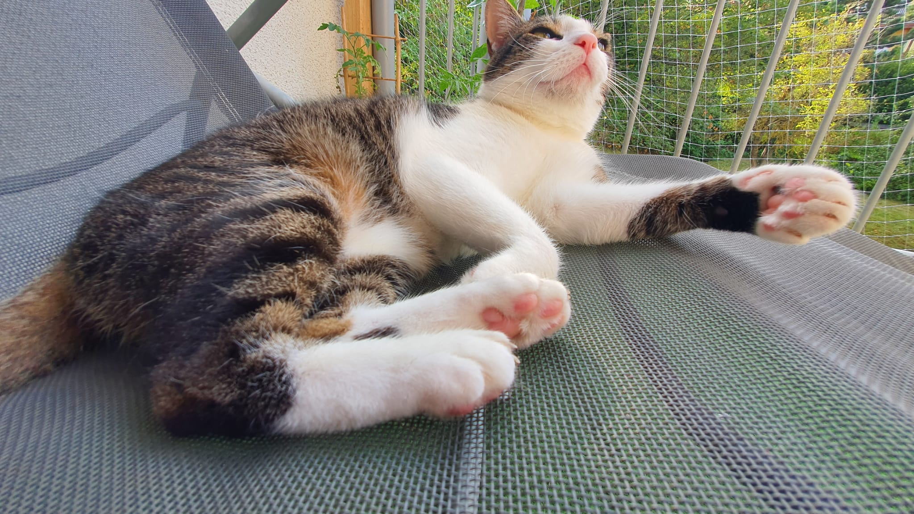

## Employment
- [2024-ongoing] Postdoctoral researcher, University of the Balearic Islands, Spain

## Education

- [2021-2024] PhD in Physics, Friedrich-Schiller-University of Jena, Germany
- [2019-2021] MSc. Physics, Friedrich-Schiller-University of Jena, Germany
- [2015-2016] DAAD Academic Exchange, Georg-August-University of Goettingen, Germany
- [2012-2017] BSc. Physics, Universidad Autonoma de Nuevo Leon, Mexico

### Thesis

- **PhD thesis**: [Gravitational Waveforms from Compact Binary Mergers with Matter](https://doi.org/10.22032/dbt.70487)
- **Master thesis**: Analytical Waveform Model of Black Hole-Neutron Star binary systems
- **Bachelor thesis**: [Optimization of the Electron Veto for the identification of hadronically decaying Tau leptons with the ATLAS detector](https://www.uni-goettingen.de/de/document/download/288e5460a87426975dcb65ae5a490067.pdf/Bachelorarbeit_Alejandra_Pillado_Gonzalez.pdf)

## Highlighted Publications 
For a complete list of publications and pre-prints, see my [ORCID](https://orcid.org/0000-0002-5034-9353) page.

- A. Gonzalez, S. Bernuzzi, A. Rashti, F. Brandoli, and R. Gamba. *Black-hole–neutron-star mergers: New numerical-relativity simulations and multipolar effective-one-body model with spin precession and eccentricity*, [Phys. Rev. D 113, 124032](https://journals.aps.org/prd/abstract/10.1103/n7hg-cc2l)
- A. Gonzalez, R. Gamba, M. Breschi, F. Zappa, G. Carullo, S. Bernuzzi and A. Nagar. *Numerical-Relativity-Informed Effective-One-Body model for Black-Hole-Neutron-Star Mergers with Higher Modes and Spin Precession*, [Phys. Rev. D 107, 084026](https://journals.aps.org/prd/abstract/10.1103/PhysRevD.107.084026)
- A. Gonzalez, F. Zappa, M. Breschi, S. Bernuzzi, D. Radice, A. Adhikari, A. Camilletti, S. V. Chaurasia, G. Doulis and S. Padamata, et al. *Second release of the CoRe database of binary neutron star merger waveforms*, 2023 Class. Quantum Grav. [40 085011](https://dx.doi.org/10.1088/1361-6382/acc231)

## Invited Talks, Seminars & Lectures

- [2025] [EOB@Work Workshop 2025](https://agenda.infn.it/event/47987/overview) in Turin, Italy
- [2024] [ECT* DTP/TALENT 2024 PhD School in Nuclear Theory for Astrophysics](https://www.ectstar.eu/trainings/dtp-talent-2024-nuclear-theory-for-astrophysics/) in Trento, Italy
- [2024] [CENTRA seminar](https://centra.tecnico.ulisboa.pt/events/?id=1169) in Lisbon, Portugal
- [2024] [DAMTP Friday GR Seminar](http://talks.cam.ac.uk/talk/index/212317) in Cambridge, UK
- [2024] [Gravity seminar](https://www.southampton.ac.uk/stag/news/seminars/2024/02/8-gravity.page) in Southampton, UK
- [2023] [AstroCoffee Seminar Series](https://cloud.itp.uni-frankfurt.de/s/gRBLK4kwpSsjwXQ) in Frankfurt, Germany
- [2023] [European Einstein Toolkit Meeting 2023](https://euet2023.web.ua.pt/) in Aveiro, Portugal

## Awarded HPC grants

- **RES, TalaIA:** "Advancing Neutron Star – Black Hole Waveforms with High-Fidelity Numerical Rela-
tivity and Realistic Physics", AECT-2026-1-0050
- **RES, MareNostrum5:** “Calibration and validation of state-of-the-art neutron star black hole gravitational
waveform models”, FI-2025-3-0013; “Far-field infrastructure study for improving bi-
nary and strong field numerical relativity simulations”, AECT-2025-2-0036; “Exploring
the phenomenology of eccentric coalescences of black hole binaries”, AECT-2024-3-
0027, “Tests of eccentric black holes binaries with CarpetX and GPUs”, AECT-2025-
3-0055
- **GCS, SuperMUC-NG:** “Gravitational waves from neutron star - black hole mergers”, allocation pn39go

## Volunteering

- [2013 - 2026] Participation in Science Outreach Events, e.g. [Noche de las Estrellas](https://nochedelasestrellas.org.mx/), [Fisica Pato2](https://www.youtube.com/@fisicapato2),
Women in Science Workshop - [CONAHCyT](https://conahcyt.mx/), [Long night of Science Jena](https://www.lndw-jena.de/en), [11F Activities](https://11defebrero.org/), [Science for Everyone 2026](https://seras.uib.cat/ciencia/).
- [2024 - ongoing] Reviewer for Classical and Quantum Gravity
- [2021 - 2024] Member of the IT Team at the Theoretisch-Physikalisches Institut (FSU)

## Miscellaneous

- **Foreign Languages:** English (C1), German (C1), Japanese (B1), Italian (B1)
- **Hobbies:** Outdoor activities (hiking, camping, sports), painting, bass guitar, reading, karaoke, and taking care of my cat (the cute fluff in the picture below)

